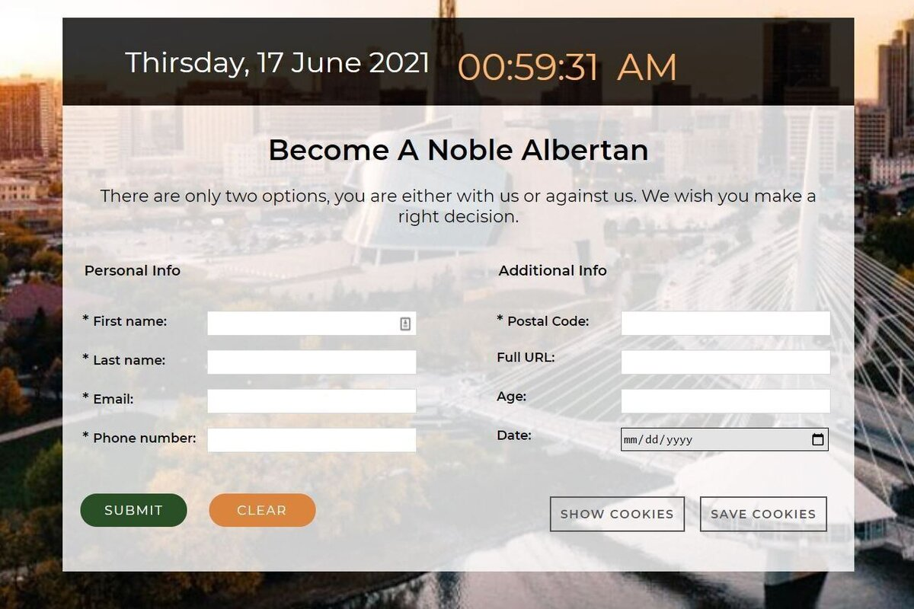

# Cookie Management

[Link to Demo](http://portfolio.alexandrpasko.com)

This is a project where a person can register in Winnipeg community. The project is driven by vanilla JavaScript. First, the form is validated according to basic requirements. If there are errors, error messages helps a user to fill the form properly. Once the form is submitted, the web page demonstrates a capability of saving cookies and displaying them on another page where they can be easily erased.

## Technologies/Languages:
* HTML
* CSS
* JavaScript
* Photoshop

## Screenshot:
